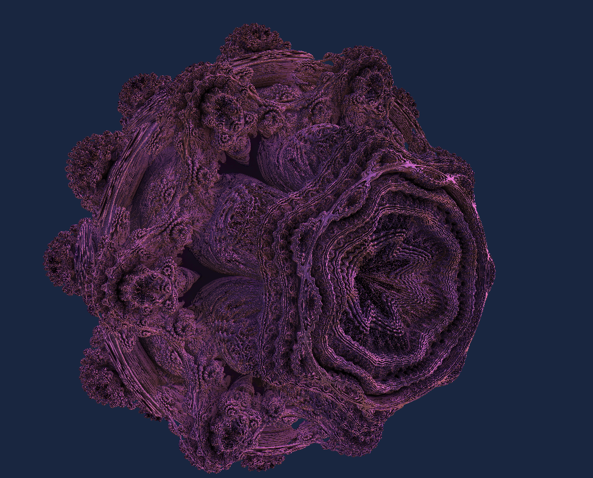
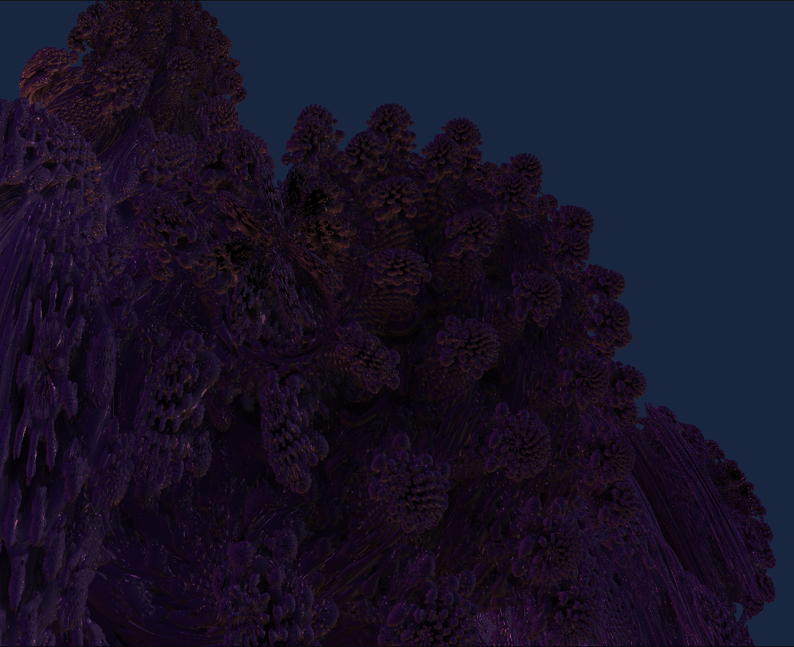

## Rust Raymarcher

[Web Demo](https://mandel.saahil-gupta.com/)

A Rust OpenGL raymarcher built on top of meshview. Made with Rust egui and glow. 

There are controls to adjust the camera position, look vector, and speed. Also an `animation` toggle that interpolates the Mandelbrot exponent from 0.0 through 20.0. When disabled, the exponent can also be controlled through the `exp` slider. For best results, use an exp of 6.0 through 8.0.

The iterations and detail sliders both control the level of detail on the SDF. The `iterations` slider controls the number of iterations the mandelbrot function checks for divergence. The `detail` slider controls the delta for which the raymarching engine will accept a collision. The default settings are enough to view most of the Mandelbrot, but to see more details on the mandelbrot, increase the `detail` slider by about 10. Note that increasing either of these sliders may result in a significant drop in framerate, as these calculations become expensive very quickly.

The raymarching logic is done in `main.frag.glsl`. Camera matrices and controls are handled in `camera.rs`. OpenGL API interactions are done in `main.rs`

The coloring was done with normals combined with orbit traps. I may potentially add lightmapping in the near future.

Check out the releases page for a Windows executable. Unfortunately this raymarcher is not optimized to run on WebGL :(

